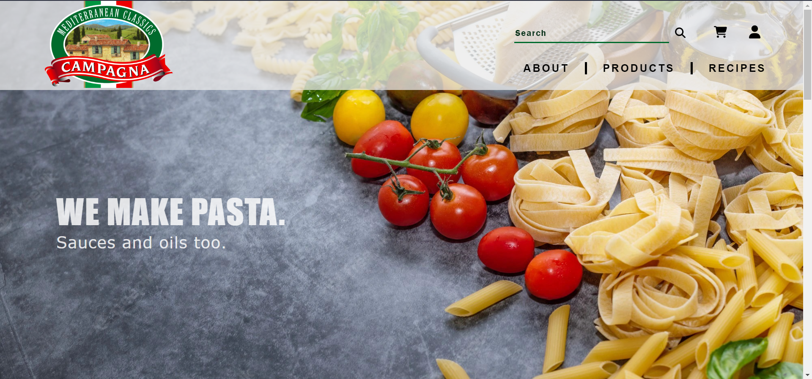

# E-commerce



E-commerce site for WEB1201 Web Fundamentals.

[Live Website](https://chiefwoods.github.io/e-commerce/)  

[Source Repository](https://github.com/ChiefWoods/e-commerce)

## Features

- Explore Campagna's heritage
- Browse a variety of delicious products

## Built With

### Tools and Languages

- [](https://html5.org/)
- [](https://www.w3.org/Style/CSS/Overview.en.html)
- [](https://js.org/index.html)

## Getting Started

### Setup

1. Clone the repository
```
git clone https://github.com/ChiefWoods/e-commerce.git
```

## Issues

View the [open issues](https://github.com/ChiefWoods/e-commerce/issues) for a full list of proposed features and known bugs.

## Acknowledgements

### Resources

- [Shields.io](https://shields.io/)
- [Pictogrammers](https://pictogrammers.com/)

### Hosting

- [GitHub Pages](https://pages.github.com/)

## Contact

[chii.yuen@hotmail.com](mailto:chii.yuen@hotmail.com)

